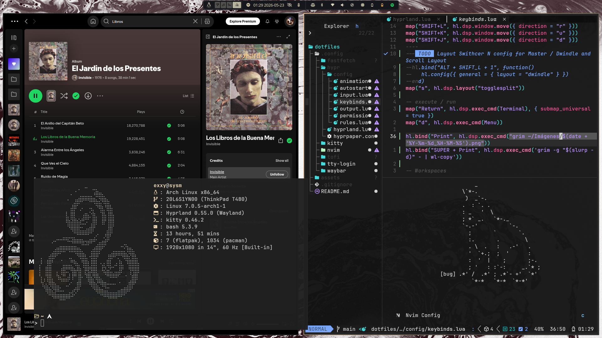

# There is no place like /home/

Hyprland dotfiles. Wayland-only setup, managed with stow.

 

## Stack

- Compositor: Hyprland
- Bar: Waybar
- Terminal: Kitty
- Launcher: Tofi 
- Notifications: Mako
- Wallpaper: Hyprpaper
- Lock: system suspend (lol)

## Packages
### Core
| Package | Description | 
| ------------- | -------------- |
| Hyprland | Wayland Compositor & Window Manager |
| Waybar | Wayland Status Bar |
| Kitty | Terminal Emulator based on beautiful kittens |

### Utilities
| Package | Description | 
| ------------- | -------------- |
| Tofi | App launcher based |
| Mako | Notification Daemon |
| Hyprpaper | Wallpaper (i think) |

### System
- pipewire
- xdg-desktop-portal-hyprland

----------

## Structure

```md
.config/
├── hypr # compositor config on lua
│   ├── config 
│   │   ├── animations.lua
│   │   ├── autostart.lua
│   │   ├── input.lua
│   │   ├── keybinds.lua
│   │   ├── output.lua
│   │   ├── permissions.lua
│   │   └── rules.lua
│   ├── hyprland.lua
│   └── hyprpaper.conf
├── kitty # terminal
│   └── kitty.conf
├── nvim # Using LazyVim
│   ├── init.lua
│   ├── lua # (with lua tho)
│   │   ├── config
│   │   │   ├── autocmds.lua
│   │   │   ├── keymaps.lua
│   │   │   └── lazy.lua
│   │   └── plugins
│   │       ├── cmp.lua
│   │       ├── colorsheme.lua
│   │       └── snacks.lua
├── tofi
│   └── config
├── tty-login # shitty tty login setup
│   └── tty-greter.sh
└── waybar # "Eww, why does it look like that" ahh top bar
    ├── config.jsonc
    └── style.css
```

## Install

```bash
$ git clone https://github.com/Exzy404/dotfiles.git && cd dotfiles 
$ stow -t ~/.config .config 
```
