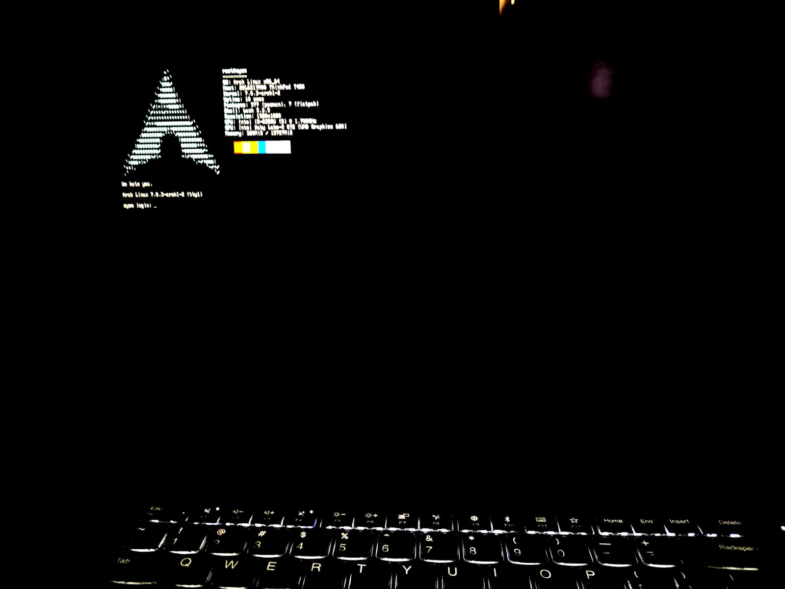

# Custom TTY@1 Log In For systemd

 

# Archivos involucrados

- `/usr/lib/systemd/system/getty@.service` Archivo de configuracion getty@.service 
- `/usr/local/bin/tty-greeter` Script que mostrara el banner/header ascii de tu eleccion

# ¿Como instalar?

1. Crea y modifica `/usr/local/bin/tty-greeter` segun lo que quieras mostrar como banner o header  
```bash
$ sudo su
$ touch /usr/local/bin/tty-greeter
$ chmod +x !!:1
$ vim !!:2 
```

Ejemplo: ./tty-greter.sh

2. Crear ~/.config/tty-login/
Crea una carpeta que contenga tu configuracion para facilitar futuras modificaciones

```bash
$ mkdir .config/tty-login
$ cd !!:1
$ ln /usr/local/bin/tty-greeter tty-greeter
$ sudo cp /usr/lib/systemd/system/getty@.service ./getty@service.bak
$ mv ~/getty@.service .config/tty-login
```

3. Deshabilitar el servicio de tu display manager

```bash
sudo systemctl disable lightdm.service
```

4. Añadirte al grupo `autologin` 
Esto lo hacemos para que no salte el login de nuestro dm

```bash
sudo usermod -aG autologin $USER
```

5. Modificar getty@.service 
- Añade o reemplaza la siguiente linea dentro de el archivo de configuracion de getty@.service

```cnf
[Service]
ExecStart=-/bin/bash -c 'setterm -clear all; /usr/local/bin/tty-greeter; exec /sbin/agetty --noclear %I $TERM'
```


# Desinstalar

```bash
$ sudo su
$ systemctl enable lightdm.service #habilitar tu Display Manager
$ gpasswd -d $USER autologin
$ mv -i ~/.config/tty-login/getty@.service.bak /usr/lib/systemd/system/getty@.service

```
